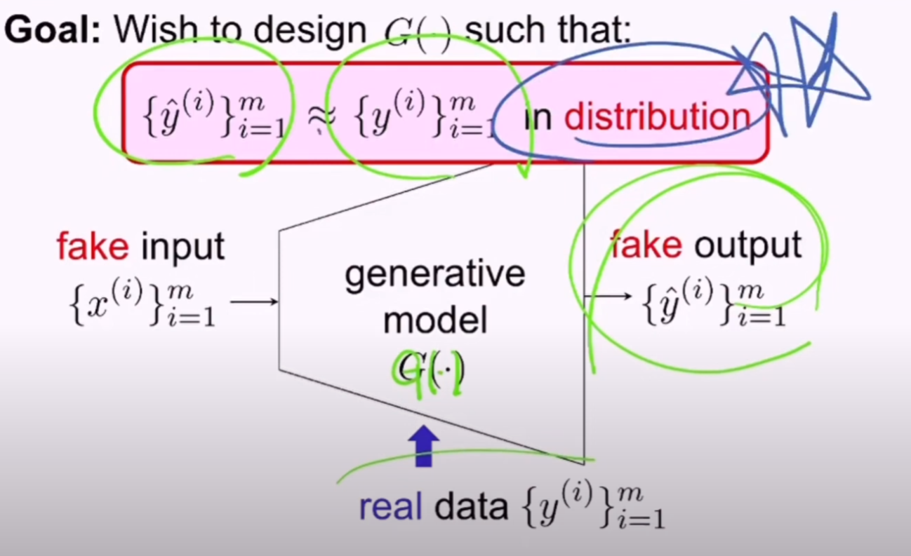
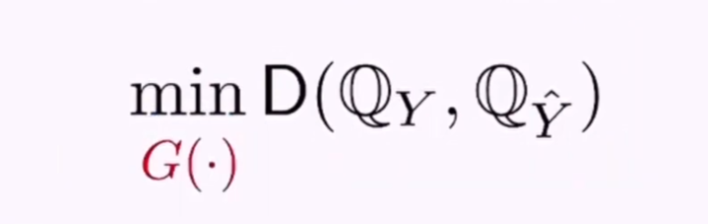

# Part 1

## recap

- Convex
- Strong duality: generic algorithm (interior point method)
- Weak duality: non-convex opt.- Lagrangian relaxation

## Machine learning

- Supervised learning
- Unsupervised learning
  - Learn something about data
  - 실제 data의 prob. 를 학습하여, synthesize data를 만듬: Generative model
  - 
- Why GAN?
  - GAN을 solving opt. problem으로 complement 가능
  - Strong duality plays a crucial role in the context

## Today

- Generative model과 opt. 간의 관계를 면밀히 조사함
  - 여러 generative model methodology 중에 하나에 집중함
  - 이유: 최근 breakthrough led to particular yet very powerful methodology
  - Formulate opt. problem for generative model
  - Discuss how the opt. leads to to be focused methodology

# Part 2

## GAN

- generating fake data so that it exhibits a similar distri. as that of real data

- A recent breakthrough

- Powerful generative model : Ian Goodfellow (2014) - GAN (Generative Adversarial Network)

  - very realistic fake samples

  - 

    

- One variant GAN

  - Leon Bottou (2017) : Wasserstein GAN
  - Why WGAN?
    - Wasserstein distance
    - Strong duality

# Part 3

## Optimization for generative modeling

- fake input은 design choice
  - A signal that we can choose arbitrary
  - 
  - How to quantify closeness in distribution?
    - Divergence measure D(P_x, P_y)
    - Good divergence P_x=P_y then 0, P_x != P_y then D get larger
  - 특정 distribution에 대해 sample을 잘(well summarized) 나타낼 수 있는 방법은 histogram (pmf), empirical distribution
  - In distribution
    - 1. compute empirical dis.
      2. Employ a well-known divergence measure in statistics, say D(-,-)

# Part 4

## Two issue

- 1. optimization variable is function! - so many choices for function - func. optimization

  - Common approximation
    - specify function class (e.g., linear )
    - represent the function with parameters (e.g., y intercept, slope) 
  - 이제 어떤 function class로 정해야 좋을까?
    - DNN well represent any arbitrary functions
    - Often parameterize G( ) with DNNs

- 2. How to choose D(-,-)?

  - 그 동안 D를 찾기위한 많은 논문이 있었음
  - WGAN, Wassertein distance를 사용한 GAN
  - 

​	
