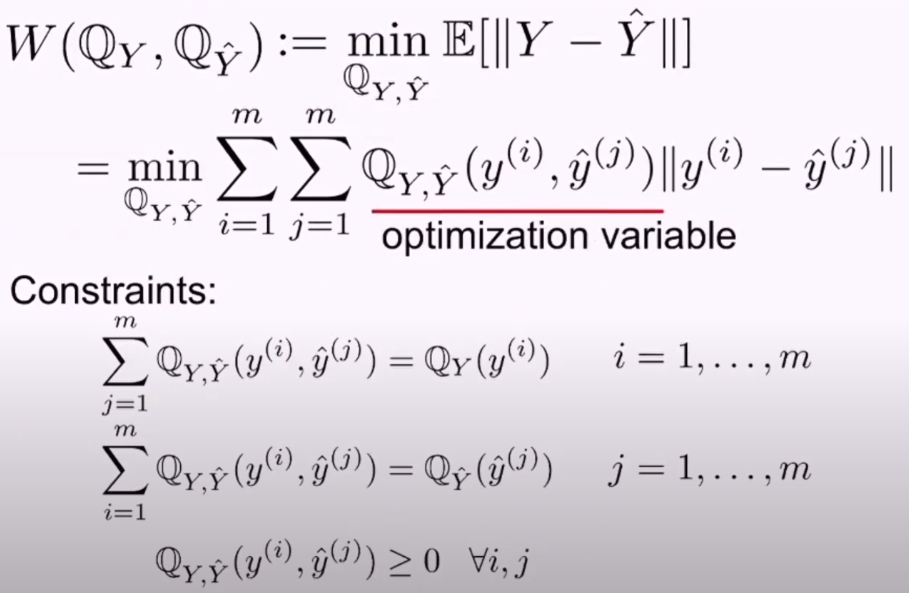
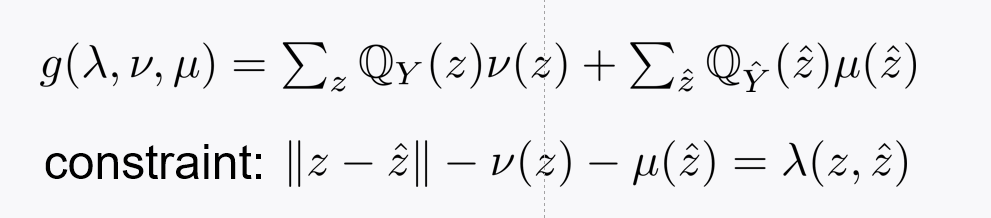
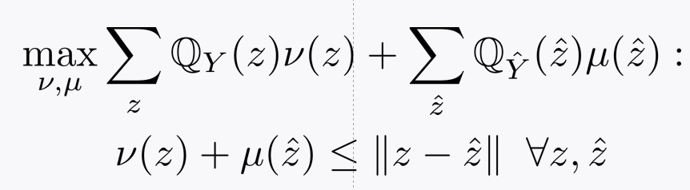

# Part 1

## recap

- Unsupervised learning
- Strong duality: strong insight on WGAN, interior point method
- Human expensive - label hard- generate synthetic data
- Generative modeling - relative to opt. problem
  - Measure: Wasserstein distance, parameterized G with DNNs
  - Y와 hat(Y)의 similarity 어떻게 quantify? compute empirical distribution - Q_y, Q_hat(y)

- Claim: Wasserstein leads to an opt. for WGAN, invented by Leon Bottou

## Today

- Review that Wasserstein distance is related to LP (LP는 simplex algorithm으로 풀 수 있었지만)
- Discuss a challenge that arises in the W-based opt (computational complexity)
- Invoke strong duality theorem to try to translate the opt. into another that addressed the challenge

# Part 2

## Wasserstein distance

- 

  

- All constraints are affine

- LP!

# Part 3

## Challenge

- How many opt. variable? - m^2 - m big data
- Extremely huge, out-of-memory issue
- Turn up strong duality!!! (Father of LP - Kantorovich) (Kantorovich duality, 이땐 duality theorem 없었지만, 특정 LP에 대한 duality를 생각해냄)

# Part 4

## Notational simplication

- Extended set - dual problem을 formularte할 때 쉽게 하기 위해 
- practical scenario
  - z, hat(z) in bar(Y)
  - 높은 확률로 y(1),---,y(m)이 같을 수 없음 caldinality(Y)=m, caldinality(mathcal(Y))=m, Y와 mathcal(Y)의 교집합 없음

## Dual problem

### Lagrange function

- Lambda 차원 4m^2인 이유: z in bar(Y), caldinaliry(bar(Y))=2m

  ### Dual func.

- x에 대한 min opt. problem

- x에 대한 term=-이 되는 경우만 고려함, 그렇지 않으면 -inf로 빠짐

  

### Dual prob.

- Lambda에 대한 constraint (\lambda \geq 0)
- Opt. variable 2m+2m=4m

### Kantorovich duality

- d*=d** 

