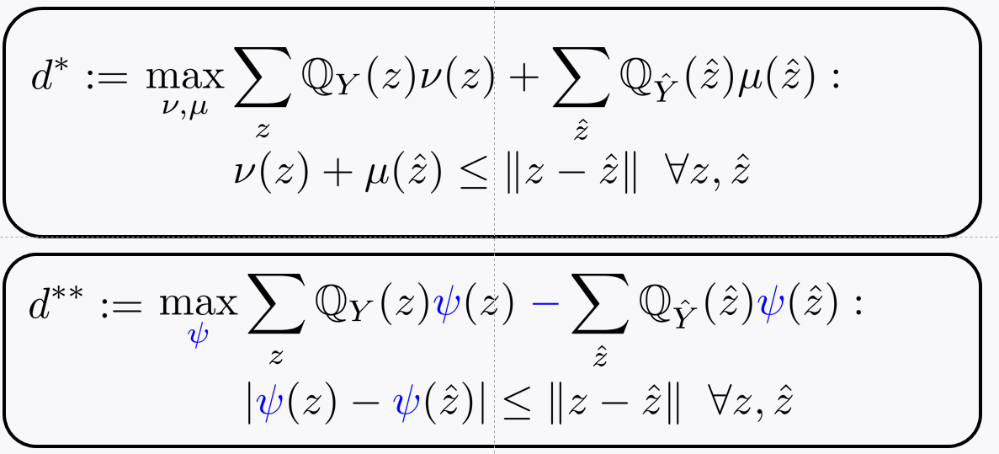
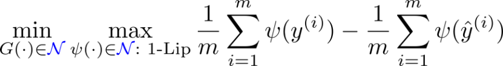

# Part 1

## recap

- W-based opt.

- Generate modeling of W-opt

  - make fake data similar to real sample y(i): \hat{y}(i)
    $$
    \min_{G()}D(Q_y,Q_{\hat y})\\
    = \min_{G()} W(Q_y,Q_{\hat y})\\
    =\min_{G()} \min_{Q_{y, {\hat y}}}\sum \sum Q_{y, {\hat y}} \|y_i - \hat{y}_i \|
    $$

  - Constraint: marginality constraint, non-negativity constraint of joint distribution

  - Opt. variable is the order of 4m^2: computationally expensive!, out of memory (oom)

- Strong duality!

  - dual problem d* : variable 4m: linear scale

- Equivalent opt. (leon bottou가 했음?)

  - d**: varialbe 2m

  

## Today

- proof: d*=d**
- Show that the proof leads to an opt. for WGAN
- Conclude the course with a few remark

# Part 2

## Proof

- Check the detail of proof in CN23
- d* <= d**

- d** <= d*	

# Part 3

## How lead to WGAN

- 1-Lipschitz function
  - function: smoothly manner, sort of continuous

- Wasserstein GAN

- 

